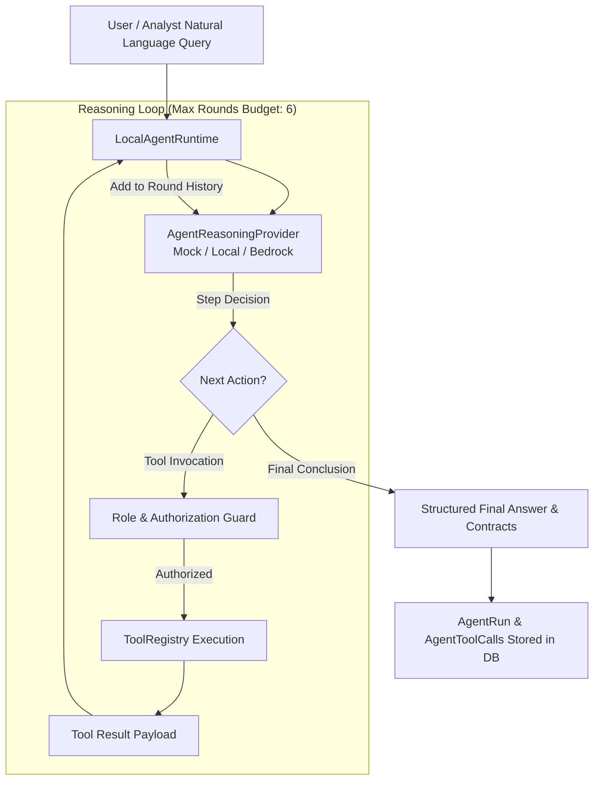
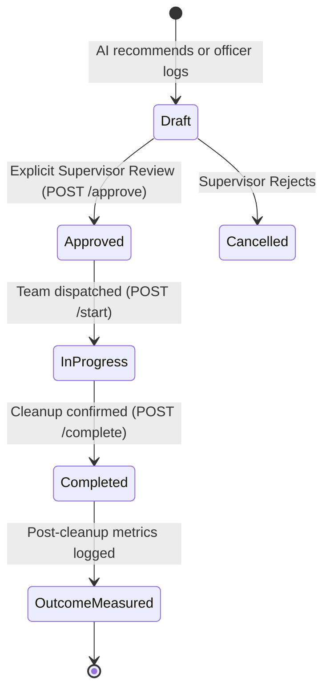

# Supervised Environmental Intelligence Agent Architecture

## 1. Overview

EcoPulse implements an autonomous reasoning agent architecture built specifically to assist municipal officers and environmental analysts in analyzing hazard trends, calculating hotspot dynamics, and formulating remediation plans.

**Crucial Safety Rule:**
The agent **never has direct unrestricted database access** and **cannot autonomously trigger irreversible real-world municipal actions**. All interactions flow through strictly typed tools, role-based authorization checks, and human supervisor gates.

---

## 2. Multi-Round Agent Loop



---

## 3. Typed Tool Registry (19 Tools)

Every tool registered in `ToolRegistry` defines:
- **`name`**: Unique identifier.
- **`description`**: Semantic guidance for reasoning providers.
- **`inputSchema`**: Validated Zod schema.
- **`authorization`**: Required user role (`RESIDENT`, `MAINTAINER`, `SUPERVISOR`, `ADMIN`).
- **`handler`**: Sandboxed execution function.

### Tool Inventory

| Tool Name | Purpose | Role Authorization |
|---|---|---|
| `get_environmental_overview` | Summary KPI metrics across city | Any |
| `get_ward_statistics` | Detailed environmental statistics for a ward | Any |
| `get_zone_statistics` | High-level metrics across municipal zone | Any |
| `get_environmental_events` | Query recent incidents by status/type | Any |
| `get_event_details` | Deep dive into a specific incident report | Any |
| `get_hotspots` | Algorithmic clusters and risk scores | Any |
| `get_hotspot_details` | Single hotspot event membership & trend | Any |
| `get_event_timeline` | Incident frequency time-series | Any |
| `get_waste_distribution` | Percentage breakdown by waste type | Any |
| `get_severity_distribution` | Percentage breakdown by severity tier | Any |
| `compare_zones` | Compare metrics between two zones | Any |
| `find_similar_events` | Semantic vector search | Any |
| `find_patterns` | Recurrence & illegal dumping patterns | Any |
| `get_nearby_events` | Radius lookup around coordinate | Any |
| `get_intervention_history` | Historical remediation log | Any |
| `get_intervention_outcomes` | Before/after metric efficacy | Any |
| `generate_visualization` | Emits structured `ChartSpec` (line/bar/pie) | Any |
| `generate_map_visualization` | Emits structured `MapSpec` (layers/markers) | Any |
| `recommend_intervention` | Formulate draft municipal response | **`SUPERVISOR`, `ADMIN`** |

---

## 4. UI Contract Payloads (No Raw HTML/JS)

When tools generate visual data, they return clean typed specifications for frontend components:

### `ChartSpec` Contract
```typescript
export interface ChartSpec {
  type: 'line' | 'bar' | 'pie' | 'scatter' | 'heatmap';
  title: string;
  xAxis: string;
  yAxis: string;
  series: Array<{
    name: string;
    data: Array<{ x: string | number; y: number }>;
  }>;
}
```

### `MapSpec` Contract
```typescript
export interface MapSpec {
  center: { lat: number; lng: number };
  zoom: number;
  layers: Array<{
    id: string;
    type: 'markers' | 'heatmap' | 'polygons' | 'hotspot_circles';
    data: any[];
    style?: Record<string, unknown>;
  }>;
}
```

---

## 5. Human-in-the-Loop Intervention Safety Gate



1. **AI Recommendation:** The agent can recommend remediation types (e.g. `CLEANUP_CREW`, `ADD_BIN`, `SURVEILLANCE_CAMERA`), but the resulting intervention is created in status `draft`.
2. **Execution Block:** Attempting to start a `draft` intervention will throw a runtime authorization error.
3. **Supervisor Approval:** Only an authenticated supervisor can approve the intervention via `POST /api/interventions/:id/approve`.
4. **Outcome Quantifier:** After completion, the system computes a composite `successScore` (0.0 to 1.0) weighting report rate reduction (40%), severity reduction (35%), and hotspot radius reduction (25%).
