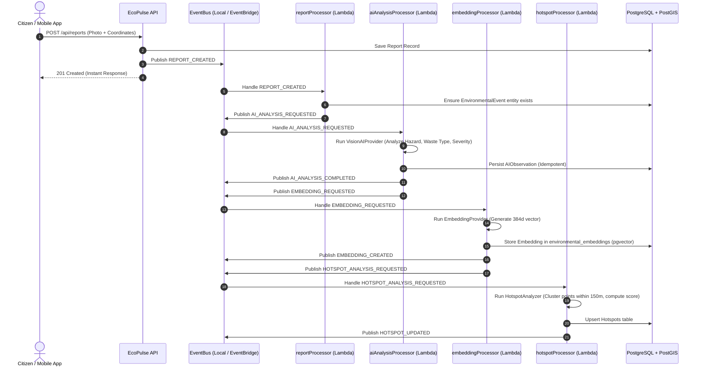

# Event-Driven Architecture & Report Pipeline

## 1. Overview

EcoPulse utilizes an asynchronous event-driven pipeline to process environmental incident reports, drone imagery, and citizen submissions. Heavy compute tasks (such as vision analysis, vector embedding computation, and geographic hotspot re-clustering) are completely decoupled from user-facing API request paths.

---

## 2. Event-Driven Lifecycle Pipeline



---

## 3. Standardized Event Envelope Contract

Every domain event emitted across EcoPulse adheres strictly to the `EcoPulseEvent` contract validated via `ecoPulseEventSchema`:

```typescript
export interface EcoPulseEvent<T = Record<string, unknown>> {
  eventId: string;        // Unique UUID for event instance
  eventType: DomainEventType; // Strongly typed enum (e.g. REPORT_CREATED, HOTSPOT_UPDATED)
  version: number;        // Schema version (currently 1)
  source: string;         // Originating subsystem (e.g. ecopulse.api, ecopulse.mobile)
  timestamp: string;      // ISO 8601 UTC timestamp
  correlationId: string;  // Trace correlation ID across multi-stage pipeline
  payload: T;             // Strongly typed payload
  actorId?: string | null;// Authenticated user or system actor ID
}
```

### Supported Domain Event Types

- `REPORT_CREATED`
- `EVIDENCE_UPLOADED`
- `AI_ANALYSIS_REQUESTED`
- `AI_ANALYSIS_COMPLETED`
- `EMBEDDING_REQUESTED`
- `EMBEDDING_CREATED`
- `HOTSPOT_ANALYSIS_REQUESTED`
- `HOTSPOT_UPDATED`
- `INTERVENTION_CREATED`
- `INTERVENTION_COMPLETED`
- `OUTCOME_MEASURED`

---

## 4. Dual-Mode EventBus Abstraction

The event backbone is abstracted behind the `IEventBus` interface:

```typescript
export interface IEventBus {
  publish<T>(eventOrType: DomainEventType | EcoPulseEvent<T>, aggregateId?: string, payload?: T): Promise<EcoPulseEvent<T>>;
  publishBatch<T>(events: EcoPulseEvent<T>[]): Promise<void>;
  subscribe<T>(type: DomainEventType, handler: EventHandler<T>): () => void;
}
```

### `LocalEventBus` (Development & Testing)
- Operates in-process using Node.js event dispatching.
- Requires zero AWS credentials.
- Synchronously tracks execution and handles exceptions without network overhead.

### `AWSEventBridgeBus` (Cloud Staging & Production)
- Routes events directly to Amazon EventBridge custom bus (`ecopulse-events-{env}`).
- Triggers AWS Lambda processors using IAM least-privilege policies.
- Includes automatic fallback to `LocalEventBus` if EventBridge is unreachable or credentials are unconfigured.

---

## 5. Idempotency & Fault Tolerance

In distributed event systems, at-least-once delivery semantics can cause duplicate event deliveries. EcoPulse guarantees idempotency at every stage:
- **`processReport`:** Checks for existing `environmental_events` record matching the `reportId` before inserting.
- **`processAIAnalysis`:** Queries `ai_observations` matching `eventId`; if already analyzed, skips LLM execution and immediately advances the pipeline.
- **`processEmbedding`:** Checks `environmental_embeddings` for existing embeddings on the target event.
- **`processHotspotAnalysis`:** Upserts existing hotspot clusters by matching geographic centroids rather than creating duplicate active hotspots.
