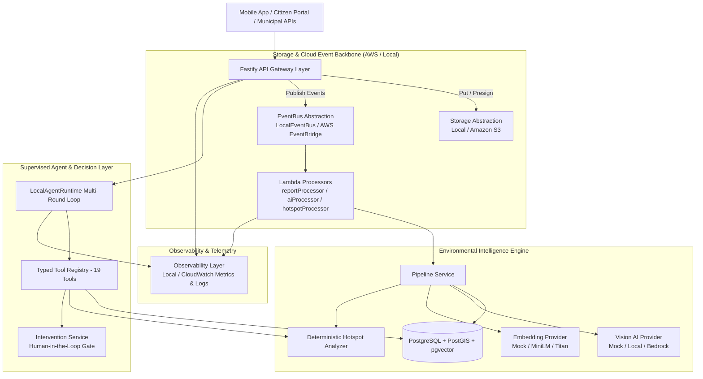

# EcoPulse System Architecture Overview

## 1. Executive Summary

EcoPulse is an AI-powered environmental intelligence and municipal response platform engineered specifically for Indian urban contexts. The system transforms unstructured citizen complaints, municipal sensor feeds, and remote sensing imagery into verifiable environmental events, predictive waste hotspots, and supervised field interventions.

The technical foundation combines:
- **Cloud Infrastructure Backbone:** AWS Serverless (S3, EventBridge, Lambda, CloudWatch, IAM).
- **Core Intelligence Layer:** Self-hosted PostgreSQL with PostGIS for geospatial analysis, pgvector for semantic retrieval, deterministic spatial-temporal hotspot clustering algorithms, and provider-agnostic AI agent runtimes.
- **Strict Decoupling:** Business logic is entirely independent of AWS SDKs via universal interfaces (`IEventBus`, `IObjectStorage`, `VisionAIProvider`, `EmbeddingProvider`, `IObservability`).
- **Cost-Conscious Design:** 100% operable in local development mode (`APP_ENV=local`) without AWS credentials or cloud billing.

---

## 2. Layered Architecture Diagram

---

## 3. Core Architectural Boundaries

| Layer | Responsibility | Key Abstraction | Primary Implementation |
|---|---|---|---|
| **API Layer** | Request routing, JWT validation, response serialization | Fastify Routes | `src/routes/*` |
| **Storage Layer** | Evidence media, drone captures, analysis artifacts | `IObjectStorage` | `LocalObjectStorage`, `S3ObjectStorage` |
| **Event Layer** | Domain event publishing, dispatching, and asynchronous fan-out | `IEventBus` | `LocalEventBus`, `AWSEventBridgeBus` |
| **AI Vision Layer** | Environmental hazard classification, severity scoring | `VisionAIProvider` | `MockVisionProvider`, `LocalVisionProvider`, `BedrockVisionProvider` |
| **Embedding Layer** | Multimodal semantic vector generation | `EmbeddingProvider` | `MockEmbeddingProvider`, `LocalEmbeddingProvider`, `BedrockEmbeddingProvider` |
| **Vector Search** | Semantic similarity & geographic distance queries | `VectorRepository` | pgvector (cosine) + Haversine distance |
| **Hotspot Engine** | Spatial clustering, temporal decay, recurrence weighting | `HotspotAnalyzer` | Spatial clusterer + scoring model |
| **Agent Runtime** | Multi-round tool orchestration, query reasoning | `AgentRuntime` | `LocalAgentRuntime` + `MockAgentProvider` |
| **Intervention Layer** | Municipal remediation workflow & human gate | `InterventionService` | Human supervisor authorization gate |
| **Observability** | Structured logging, latency metrics, error tracing | `IObservability` | `LocalObservability`, `CloudWatchObservability` |

---

## 4. Non-Negotiable Architectural Principles

1. **Local-First & Zero-Cost Baseline:** The application runs out of the box with `pnpm dev` using standard local PostgreSQL. AWS credentials are never required for test execution or local feature development.
2. **API First for External Services:** Official APIs and structured data pipelines are always favored over fragile web scraping.
3. **Execution Boundary for AI:** AI models and agents formulate proposals and recommendations, but **never execute irreversible or consequential real-world interventions without explicit supervisor authorization**.
4. **Action & Round Budgets:** All agent executions enforce strict round limits (default 6 rounds) and timeouts (default 30s) to prevent uncontrolled loops and resource exhaustion.
5. **Idempotency Everywhere:** Duplicate delivery of domain events (common in distributed event systems like EventBridge) produces identical database state without duplicate observations or alerts.
