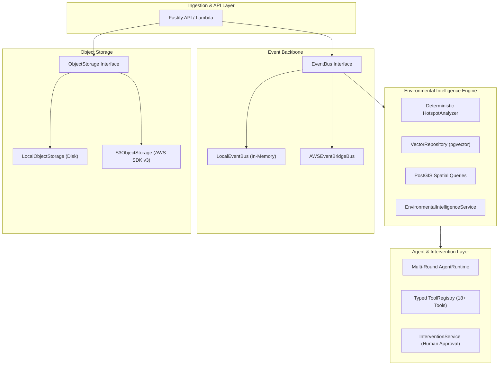

# EcoPulse AWS Foundation Architecture Assessment

**Date:** October 8, 2026  
**Status:** Assessment Complete (Phase: Foundational Transition)  
**Target:** AWS-Ready Event-Driven Environmental Intelligence Architecture for India  

---

## 1. Executive Summary

EcoPulse currently operates as a TypeScript monorepo with an operational Fastify backend, Drizzle ORM + PostgreSQL database, and an Expo SDK 57 mobile client. The application contains working implementations of citizen reporting, geocoding, immutable point ledgers, rewards, and human-in-the-loop review queues with 59 passing tests.

To transition into an **AWS-ready environmental intelligence platform for India**, we must establish a clean architectural foundation that decouples core environmental domain logic, geospatial intelligence, vector search, and agent orchestration from any specific cloud provider or UI assumptions.

---

## 2. Inventory of Existing Assets

| Area | Current Implementation | Assessment & Reuse Strategy |
| :--- | :--- | :--- |
| **Backend Framework** | Fastify in `apps/api` (port 4000) with route-level Zod validation | **Reuse & Extend:** Retain existing routes for backward compatibility. Expose new `/api/intelligence/*`, `/api/agent/*`, and `/api/interventions/*` endpoints. |
| **Database & ORM** | PostgreSQL + Drizzle ORM in `apps/api/src/db` | **Reuse & Extend:** Existing `reports`, `evidence`, `users`, `point_ledger` tables are rock solid. Add PostGIS geometry columns and `pgvector` extension for environmental embeddings. |
| **Authentication** | JWT middleware in `apps/api/src/middleware/auth.middleware.ts` with bcrypt | **Reuse:** Retain existing RBAC (`RESIDENT`, `MAINTAINER`, `WARD_ADMIN`, `SUPER_ADMIN`). |
| **Domain Events** | In-process `EventEmitter` in `apps/api/src/events/event-bus.ts` | **Refactor into Adapter Pattern:** Introduce `EventBus` interface with `LocalEventBus` (for dev/tests) and `AWSEventBridgeBus` (for AWS production). |
| **Object Storage** | Local filesystem storage in `apps/api/src/services/storage.service.ts` | **Refactor into Adapter Pattern:** Introduce `ObjectStorage` interface with `LocalObjectStorage` (dev/test) and `S3ObjectStorage` (AWS SDK v3 with signed URLs). |
| **AI Layer** | In-process Mock AI Provider in `apps/api/src/agents/` | **Standardize Abstraction:** Formalize `VisionAIProvider` (Mock, Local, optional Bedrock) and `EmbeddingProvider` (Mock, Local, optional Bedrock Titan). |
| **Geospatial & Hotspots** | Basic point queries & ray-casting in `apps/api/src/services/geo.service.ts` | **New Core Engine:** Build deterministic `HotspotAnalyzer` with spatial neighborhood clustering, time windows, and severity weighting. |
| **Agent Foundation** | Hardcoded logic in stubs | **New Core Engine:** Build multi-round `AgentRuntime`, `ToolRegistry`, and typed tools (`get_hotspots`, `recommend_intervention`, etc.). |
| **Infrastructure as Code** | Initial skeleton in `infrastructure/terraform/main.tf` | **Expand:** Structure modular Terraform in `infra/aws/` for S3, EventBridge, Lambda, CloudWatch, and IAM with zero always-on paid resources. |
| **Testing** | Vitest with 59 passing tests in `apps/api/test/` | **Preserve & Expand:** Maintain 100% green status on existing tests while adding unit/integration tests for the new AWS pipeline. |

---

## 3. Core Boundaries & Decoupling Strategy

---

## 4. Cost & AWS Guardrails

1. **Serverless & Lambda-First:** No always-running EC2, ECS, or OpenSearch clusters.
2. **Postgres + PostGIS + pgvector:** Self-hosted or existing local DB used during development and tests. No mandatory AWS RDS instance.
3. **Mock Defaults:** Default `APP_ENV=local` uses `MockVisionProvider`, `MockEmbeddingProvider`, `MockAgentProvider`, `LocalEventBus`, and `LocalObjectStorage`.
4. **Bedrock Optional:** Bedrock is an optional adapter enabled via `AI_PROVIDER=bedrock`. Zero Bedrock costs in local development or CI.
5. **S3 Lifecycles & CloudWatch Retention:** Explicit 14-day retention rules in Terraform to prevent lingering cloud costs.
